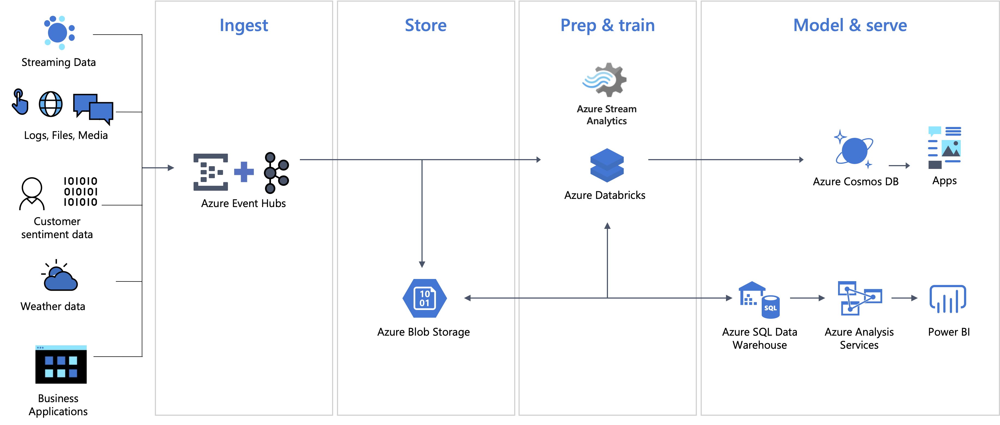
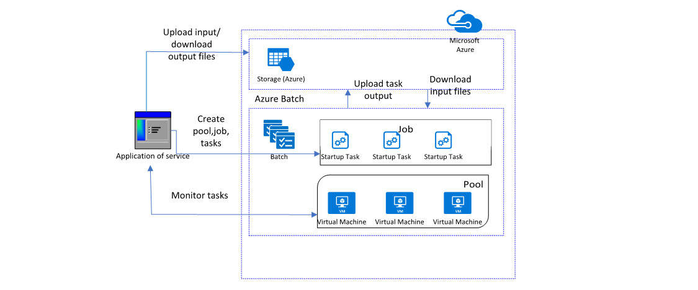

# Integration of Services on Azure


***<u>Reference: Microsoft Docs</u>***

## Messages


​					***<u>Reference: Microsoft Docs</u>***


​				***<u>Reference: Microsoft Docs</u>***

- **Raw Data** *Produced* by a service to be *Consumed* or *Stored* elsewhere

- Contains the data that triggered the **Message** pipeline

- **Publisher** of the *Message* has an expectation about how the **Consumer** handles the *Message*

- **Contract** exists between the two sides

  - **Who** is sending the message?
  - **What** is the message?
  - **Where** is the message being sent?

  

## Facts/Events


​								***<u>Reference: Microsoft Docs</u>***

- **Lightweight** notification of a *Condition* or a *State* change

- **Publisher** of the *Event* has no expectation about how the event is handled

- **Consumer** of the *Event* decides what to do with the notification

- **Events** can be

  - **Discrete** Events report state change and are actionable

    - **Discrete** - Instanteneous

  - **Series** Events report a condition and are analysable; time-ordered and interrelated

    - **Time Series** - Continuous Stream

      
    
  
  ### Comparison of Messaging Services
  
  | **Service** | **Purpose**                     | **Type**                      | **When to use**                             |
  | ----------- | ------------------------------- | ----------------------------- | ------------------------------------------- |
  | Event Grid  | Reactive programming            | Event distribution (discrete) | React to status changes                     |
  | Event Hubs  | Big data pipeline               | Event streaming (series)      | Telemetry and distributed data streaming    |
  | Service Bus | High-value enterprise messaging | Message                       | Order processing and financial transactions |


## Orchestraors

- ### Serverless

  

  ***<u>Reference: Microsoft Docs</u>***

  
  
  - Full **Abstraction** of *Servers*
  - Instant, **Event-Driven Scalability**
  - **Pay-per-use**

  

  #### Azure Function

  

  ***<u>Reference: Microsoft Docs</u>***
  
  
  
  - **Integrated programming model** 
    - Built-in **Triggers** and **Bindings** to define when a *Function* is invoked and to what *Data* it connects
  - **Enhanced development experience**
    - **Code**, **Test**, **Debug** and **Monitor**
  - **Hosting options flexibility**
    - Multiple *Deployment* models 
    - No Compromise on *Development* experience

  

  #### Logic App
  
  
  
  ***<u>Reference: Microsoft Docs</u>***
  
  - **Low Code** Approach
  - **Automate** workflows
  - **Orchestrate** business processes
    - *Out-of-the-box* **Connectors** reduce integration challenges
    - *Connect* and *Integrate* Data from the cloud to on-premises
    - **B2B** and Enterprise *Messaging* in the cloud
    - Powerful web-based **Workflow Designer**
  
  
  
  #### Containers


***<u>Reference: Microsoft Docs</u>***

- **Deploy** your applications *quickly* and *predictably*

- **Scale** your applications on the fly

- **Roll out** new features seamlessly

- **Limit** hardware usage to required resources only

  

#### App Services


***<u>Reference: Microsoft Docs</u>***


#### API Management


***<u>Reference: Microsoft Docs</u>***

- Cloud hosted, turnkey solution 
- Works with any host, API, and scale
- Promotes and supports developer engagement
- Attract more developers
- Secures and optimizes APIs
- Provides API insights and analytics


## Messaging Services - Deep Dive


***<u>Reference: Microsoft Docs</u>***


## Service Bus

- Intended for traditional enterprise applications which require *transactions, ordering, duplicate detection, and instantaneous consistency*
- Enables cloud-native applications to provide reliable *state transition management* for business processes 
- Facilitates highly secure communication across hybrid cloud solutions and can connect existing on-premises systems to cloud solutions
- *Brokered messaging* system. It stores messages in a "broker" (*for example, a queue*) until the consuming party is ready to receive the messages 
- Available either as data streams or bundled event batches
- *Reliable Asynchronous* message delivery (enterprise messaging as a service) that requires polling
- Advanced messaging features like *FIFO, batching/sessions, transactions, dead-lettering, temporal control, routing and filtering, and duplicate detection*
- *At least once* delivery
- Optional *in-order* delivery

### Queues


​					***<u>Reference: Microsoft Docs</u>***

- Offer *First In, First Out* (FIFO) message delivery to one or more competing consumers

- Receivers typically receive and process messages in the order in which they were added to the queue, and only one message consumer receives and processes each message

- Producers (senders) and consumers (receivers) do not have to be sending and receiving messages at the same time, because messages are stored durably in the queue

- Producer does not have to wait for a reply from the consumer in order to continue to process and send messages

- Related benefit is *load* *levelling* which enables producers and consumers to send and receive messages at different rates

- **Brokered Transfer**

  

  ​					***<u>Reference: Microsoft Docs</u>***

  - **Maximize Availability** - delays arising in services won't have an immediate and direct impact on the application
  - **Producer** can continue to post messages to the queue even when the service isn't available or isn't currently processing messages
  - **Consumer** can process at its own pace, without being overloaded
  - **Maximize Scalability** because both the number of queues and the number of services can be varied to meet demand

- **Competing Consumer**

  

  ​					***<u>Reference: Microsoft Docs</u>***
  
  - Multiple receivers compete for messages on the same queue 
  - Provides Automatic **Load Balancing** of work to receivers volunteering for jobs
  - Improves **Reliability**
    - Messages aren't sent to a specific service instance
    - A failed service instance won't block a producer
    - Messages can be processed by any working service instance.
  - **Scalable** - The system can dynamically increase or decrease the number of instances of the consumer service as the volume of messages fluctuates.
  - Improve **Resiliency**
    - Consumer service instance reads and processes the message as part of a transactional operation
    - If the consumer service instance fails, this pattern can ensure that the message will be returned to the queue to be picked up and handled by another instance of the consumer service
  
  

### Topics and subscriptions


​					***<u>Reference: Microsoft Docs</u>***

- Provide a one-to-many form of communication, in a *publish/subscribe* pattern

- Useful for scaling to large numbers of recipients, each published message is made available to each subscription registered with the topic 

- Messages are sent to a topic and delivered to one or more associated subscriptions

- #### Fan-Out

  

  ***<u>Reference: Microsoft Docs</u>***

  - ##### Message Distribution

    - Each receiver gets its own copy of each message. Subscriptions are independent. Allows for many independent ‘taps’ into a message stream. Subscriber can filter down by interest.

  - ##### Partitioned Message Distribution

    - Receiver get mutually exclusive slices of the message stream by creating appropriate filter expressions

      

- #### Filtering

  

  ​			***<u>Reference: Microsoft Docs</u>***
  
  - Distribute messages across topic subscriptions in a predictable fashion, but not necessarily exclusive
  - Up to 2000 rules per subscription
  - **SQL Filters** - SQL-like conditional expressions
  - **Boolean filters** - **TrueFilters** and **FalseFilters** either cause all arriving messages (**true**) or none of the arriving messages (**false**) to be selected for the subscription. These two filters derive from the SQL filter
  - **Correlation Filters** - Set of conditions that are matched against one or more of an arriving message's user and system properties


### Service Bus - Reliability

#### Throttling

- Throttling from an external system on which Service Bus depends
- Throttling occurs from interactions with storage and compute resources
- Code must read the error and halt any retries of the message for at least 10 seconds. Since the error can happen across pieces of the customer application, it is expected that each piece independently executes the retry logic
- The code can reduce the probability of being throttled by enabling partitioning on a queue or topic

#### Issue for an Azure dependency

- Issue for a system on which Service Bus depends. For example, a given part of storage can encounter issues
- To work around these types of issues, Service Bus regularly investigates and implements mitigations
- Due to the nature of the mitigation, a sent message can take up to 15 minutes to appear in the affected queue or subscription and be ready for a receive operation

#### Service Bus failure on a single subsystem

- Failure of Service Bus on single subsystem. In this situation, a compute node can get into an inconsistent state and must restart itself, causing all entities it serves to load balance to other nodes. This in turn can cause a short period of slow message processing
- The client application generates a *System.TimeoutException* or *MessagingException* exception. Service Bus contains a mitigation for this issue in the form of automated client retry logic. Once the retry period is exhausted and the message is not delivered

### Peek Lock – *At least once*

- **Sender** sends the messages.
- **Receiver** locks the message from other receivers.
- The next **Receiver** locks the next message.
- **Complete** removes the message from the queue.
- **Abandon** gives up lock and makes it available for the next receiver

### Receive and Delete – *At most once*

- **Sender** sends the messages

- **Receiver** receives the message and deletes from the queue

- The next receiver receives and **Deletes** the next message

- **Abandon** and **Complete** operations are not needed

  

### Message Sessions


​					***<u>Reference: Microsoft Docs</u>***

- Sessions allow pinning sets of related sets of related messages to a receiver even when using competing consumers
- Session state may be used to store intermediate state for a session
- A session receiver is created by a client accepting a session
- When the session is accepted and held by a client, the client holds an exclusive lock on all messages with that session's **session ID** in the queue or subscription. It will also hold exclusive locks on all messages with the **session ID** that will arrive later
- The lock is released when you call close methods on the receiver or when the lock expires. There are methods on the receiver to renew the locks as well
- When multiple concurrent receivers pull from the queue, the messages belonging to a particular session are dispatched to the specific receiver that currently holds the lock for that session
- The session lock held by the session receiver is an umbrella for the message locks used by the *peek-lock* settlement mode
- Only one receiver can have a lock on a session
- A receiver may have many in-flight messages, but the messages will be received in order
- Abandoning a message causes the same message to be served again with the next receive operation


***<u>Reference: Microsoft Docs</u>***


### Duplicate Detection

- Helps keep track of the application-controlled *MessageId* of all messages sent into a queue or topic during a specified time window

- If any new message is sent with *MessageId* that was logged during the time window, the message is reported as accepted (the send operation succeeds)

- Newly sent message is instantly ignored and dropped. No other parts of the message other than the *MessageId* are considered

- Application control of the identifier is essential, because only that allows the application to tie the *MessageId* to a business process context from which it can be predictably reconstructed when a failure occurs

- Duplicate detection history time window can be configured during which message-ids are retained. This value defaults to 10 minutes for queues and topics, with a minimum value of 20 seconds to maximum value of 7 days

- Enabling duplicate detection and the size of the window directly impact the queue (and topic) throughput, since all recorded message-ids must be matched against the newly submitted message identifier

- Keeping the window small means that fewer message-ids must be retained and matched, and throughput is impacted less

- For high throughput entities that require duplicate detection, you should keep the window as small as possible

  

### Service Bus - Transactions

- Groups two or more operations together into an *execution scope*. By nature, such a transaction must ensure that all operations belonging to a given group of operations either succeed or fail jointly. In this respect transactions act as one unit, which is often referred to as *atomicity*
- If Service Bus accepts a message, it has already been stored and labeled with a sequence number. From then on, any message transfers within Service Bus are coordinated operations across entities, and will neither lead to loss (source succeeds and target fails) or to duplication (source fails and target succeeds) of the message
- Service Bus supports grouping operations against a single messaging entity (*queue, topic, subscription*) within the scope of a transaction. For example, you can send several messages to one queue from within a transaction scope, and the messages will only be committed to the queue's log when the transaction successfully completes

### Scheduled Messages

- You can submit messages to a queue or topic for delayed processing; for example, to schedule a job to become available for processing by a system at a certain time. This capability realizes a reliable distributed time-based scheduler.

- Scheduled messages do not materialize in the queue until the defined enqueue time. Before that time, scheduled messages can be canceled. Cancellation deletes the message
- The SequenceNumber for a scheduled message is only valid while the message is in this state. As the message transitions to the active state, the message is appended to the queue as if had been enqueued at the current instant, which includes assigning a new SequenceNumber
- Because the feature is anchored on individual messages and messages can only be enqueued once, Service Bus does not support recurring schedules for messages

### Deferred Messages

- Deferral is a feature created specifically for workflow processing scenarios. Workflow frameworks may require certain operations to be processed in a particular order
- They may have to postpone processing of some received messages until prescribed prior work that's informed by other messages has been completed
- Ultimately, deferral aids in reordering messages from the arrival order into an order in which they can be processed, while leaving those messages safely in the message store for which processing needs to be postponed
- If a message can't be processed because a particular resource for handling that message is temporarily unavailable but message processing shouldn't be summarily suspended, a way to put that message on the side for a few minutes is to remember the sequence number in a *scheduled message* to be posted in a few minutes, and re-retrieve the deferred message when the scheduled message arrives
- If a message handler depends on a database for all operations and that database is temporarily unavailable, it shouldn't use deferral, but rather suspend receiving messages altogether until the database is available again

### Retrieving deferred messages

- Deferred messages remain in the main queue along with all other active messages (*unlike dead-letter messages that live in a subqueue*), but they can no longer be received using the regular receive operations. Deferred messages can be discovered via [message browsing](https://docs.microsoft.com/en-us/azure/service-bus-messaging/message-browsing) if an application loses track of them
- To retrieve a deferred message, its owner is responsible for remembering the sequence number as it defers it
- Any receiver that knows the sequence number of a deferred message can later receive the message by using receive methods that take the sequence number as a parameter. For more information about sequence numbers, see [Message sequencing and timestamps](https://docs.microsoft.com/en-us/azure/service-bus-messaging/message-sequencing)

### Auto-forwarding


​										***<u>Reference: Microsoft Docs</u>***


​													***<u>Reference: Microsoft Docs</u>***

- If the destination entity accumulates too many messages and exceeds the quota, or the destination entity is disabled, the source entity adds the messages to its [dead-letter queue](https://docs.microsoft.com/en-us/azure/service-bus-messaging/service-bus-dead-letter-queues) until there is space in the destination *(or the entity is re-enabled*)
- Messages continue to live in the dead-letter queue, so you must explicitly receive and process them from the dead-letter queue
- A first-level topic with 20 subscriptions, each of them chained to a second-level topic with 200 subscriptions, allows for higher throughput than a first-level topic with 200 subscriptions, each chained to a second-level topic with 20 subscriptions
- To create a subscription that is chained to another queue or topic, the creator of the subscription must have **Manage** permissions on both the source and the destination entity. Sending messages to the source topic only requires **Send** permissions on the source topic
- **Messages that exceed 4 hops are dead-lettered**


### Service Bus - Paired namespaces


​					***<u>Reference: Microsoft Docs</u>***


​									***<u>Reference: Microsoft Docs</u>***

- Supports scenarios in which a Service Bus entity or deployment within a data center becomes unavailable
- To maintain application availability during an outage, Service Bus users can use two separate namespaces, preferably in separate data centers, to host their messaging entities
  - **Primary namespace**: The namespace with which your application interacts, for send and receive operations
  - **Secondary namespace**: The namespace that acts as a backup to the primary namespace. Application logic does not interact with this namespace
  - **Failover interval**: The amount of time to accept normal failures before the application switches from the primary namespace to the secondary namespace
- Paired namespaces support *send availability*. Send availability preserves the ability to send messages. To use send availability, your application must meet the following requirements:
  - Messages are only received from the primary namespace
  
  - Messages sent to a given queue or topic might arrive out of order
  
  - Messages within a session might arrive out of order. This is a break from normal functionality of sessions. This means that your application uses sessions to logically group messages
  
  - Session state is only maintained on the primary namespace
  
  - The primary queue can come online and start accepting messages before the secondary queue delivers all messages into the primary queue
  
    


### Code Examples

**Refer** - https://github.com/monojit18/AzIntegrationServices/tree/main/ServiceBus

#### SendQueueMessageAsync

```c#
private static async Task<ResponseModel> SendQueueMessageAsync
            (string queueNameString, HeaderModel headerModel, List<MessageModel> messagesList)
        {

            if (kServiceBusClient == null)
                kServiceBusClient = new ServiceBusClient(headerModel.ConnectionString);

            var serviceBusSender = kServiceBusClient.CreateSender(queueNameString);            
            var serviceBusMessagesList = PrepareAllMessages(messagesList);
            ResponseModel responseModel = null;

            try
            {

                await serviceBusSender.SendMessagesAsync(serviceBusMessagesList);
                responseModel = new ResponseModel()
                {

                    Code = 200,
                    Message = $"message batch sent:{serviceBusMessagesList.Count}"

                };
            }
            catch(ServiceBusException ex)
            {

                responseModel = new ResponseModel()
                {

                    Code = 400,
                    Message = ex.Message

                };
            }
            finally
            {
                await serviceBusSender.DisposeAsync();
            }

            return responseModel;

        }
```


#### ScheduleQueueMessageAsync

```c#
private static async Task<List<ResponseModel>> ScheduleQueueMessageAsync
            (string queueNameString, HeaderModel headerModel, List<MessageModel> messagesList,
            Dictionary<string, int> queryStringMap)
        {

            if (kServiceBusClient == null)
                kServiceBusClient = new ServiceBusClient(headerModel.ConnectionString);

            var serviceBusSender = kServiceBusClient.CreateSender(queueNameString);            
            var serviceBusMessagesList = PrepareAllMessages(messagesList);                
            int delayMinutes = (int)(queryStringMap["delayBy"])/60;
            long scheduleSequence = 0;            
            var responseModelsList = new List<ResponseModel>();

            try
            {

                
                var scheduledTasksList = serviceBusMessagesList.Select(
                    async (ServiceBusMessage serviceBusMessage) =>
                {

                    scheduleSequence = await serviceBusSender.ScheduleMessageAsync(
                                                serviceBusMessage,
                                                DateTimeOffset.Now.AddMinutes(delayMinutes));
                    var responseModel = new ResponseModel()
                    {

                        Code = 200,
                        Message = $"message scheduled:{scheduleSequence}"

                    };
                    responseModelsList.Add(responseModel);

                }).ToList();

                await Task.WhenAll(scheduledTasksList);
                
            }
            catch (ServiceBusException ex)
            {

                var responseModel = new ResponseModel()
                {

                    Code = 400,
                    Message = ex.Message

                };
                responseModelsList.Add(responseModel);

            }
            finally
            {
                await serviceBusSender.DisposeAsync();
            }

            return responseModelsList;

        }
```


#### ReadFromDeadLetterQueue

```c#
[HttpGet]
        [Route("deadletter/queue/{queueNameString}")]
        [ProducesResponseType(StatusCodes.Status200OK)]
        [ProducesResponseType(StatusCodes.Status400BadRequest)]
        public async Task<IActionResult> ReadFromDeadLetterQueue
            (string queueNameString, [FromHeader] HeaderModel headerModel)
        {

            if (kServiceBusClient == null)
                kServiceBusClient = new ServiceBusClient(headerModel.ConnectionString);

             var deadLetterReceiver = kServiceBusClient.CreateReceiver(queueNameString,
             new ServiceBusReceiverOptions()
             {

                 SubQueue = SubQueue.DeadLetter,
                 ReceiveMode = ServiceBusReceiveMode.ReceiveAndDelete

             });

            MessageModel receivedModel = null;
            ErrorModel errorModel = null;

            try
            {

                var receivedMessage = await deadLetterReceiver.ReceiveMessageAsync(kWaitTimeSpan);
                if (receivedMessage == null)
                    throw new ArgumentNullException(nameof(receivedMessage));

                receivedModel = JsonConvert.DeserializeObject<MessageModel>
                                    (Encoding.UTF8.GetString(receivedMessage.Body));
                if (receivedModel == null)
                    throw new ArgumentNullException(nameof(receivedModel));

            }
            catch(ArgumentNullException ex)
            {

                errorModel = new ErrorModel()
                {

                    Code = 500,
                    Message = ex.Message

                };

            }
            finally
            {

                await deadLetterReceiver.DisposeAsync();

            }

            return Ok((receivedModel != null) ? receivedModel : errorModel);

        }
```


#### ForwardTopicAsync

```c#
[HttpPost]
        [Route("forward/topic/{topicNameString}/subscription/{subscriptionNameString}")]
        [ProducesResponseType(StatusCodes.Status200OK)]
        [ProducesResponseType(StatusCodes.Status400BadRequest)]
        public async Task<IActionResult> ForwardTopicAsync
            (string topicNameString, string subscriptionNameString,
            [FromHeader] ForwardHeaderModel forwardHeaderModel,
            [FromQuery] Dictionary<string, string> queryStringMap)
        {

            var serviceBusClientOptions = new ServiceBusClientOptions()
            {

                EnableCrossEntityTransactions = true,                
                TransportType = ServiceBusTransportType.AmqpTcp

            };

            if (kServiceBusClient == null)
                kServiceBusClient = new ServiceBusClient(forwardHeaderModel.ConnectionString,
                                                         serviceBusClientOptions);

            var serviceBusSessionReceiverOptions = new ServiceBusSessionReceiverOptions()
            {

                PrefetchCount = 2,
                ReceiveMode = ServiceBusReceiveMode.PeekLock              

            };

            ServiceBusSessionReceiver sessionReceiver = null;
            ServiceBusSender nextHopSender = null;
            OCRModel receivedModel = null;
            ErrorModel errorModel = null;

            try
            {

                var shouldForce = (queryStringMap != null) && queryStringMap["force"].Equals("true");
                var sessionNameString = queryStringMap["session"];

                //var nextHopConnectionString = forwardHeaderModel.NextHopConnectionString;
                var nextHopTopicNameString = forwardHeaderModel.NextHopTopicName;                
                var nextHopSessionNameString = forwardHeaderModel.NextHopSessionName;

                sessionReceiver = await kServiceBusClient.AcceptSessionAsync
                (topicNameString, subscriptionNameString, sessionNameString,
                serviceBusSessionReceiverOptions);

                nextHopSender = kServiceBusClient.CreateSender(nextHopTopicNameString);

                var receivedMessage = await sessionReceiver.ReceiveMessageAsync(kWaitTimeSpan);                                            
                if (receivedMessage == null)
                    throw new ArgumentNullException(nameof(receivedMessage));

                receivedModel = JsonConvert.DeserializeObject<OCRModel>
                                    (Encoding.UTF8.GetString(receivedMessage.Body));
                if (receivedModel == null)
                    throw new ArgumentNullException(nameof(receivedModel));

                using (var ts = new TransactionScope(TransactionScopeAsyncFlowOption.Enabled))
                {

                    await sessionReceiver.CompleteMessageAsync(receivedMessage);

                    var serviceBusMessage = new ServiceBusMessage(receivedMessage);
                    serviceBusMessage.TransactionPartitionKey = receivedMessage.PartitionKey;
                    await nextHopSender.SendMessageAsync(serviceBusMessage);
                    ts.Complete();

                }
            }
            catch (ArgumentNullException ex)
            {

                errorModel = new ErrorModel()
                {

                    Code = 400,
                    Message = ex.Message

                };

            }
            catch (ServiceBusException ex)
            {

                errorModel = new ErrorModel()
                {

                    Code = 500,
                    Message = ex.Message

                };

            }
            finally
            {

                await sessionReceiver.DisposeAsync();
                await nextHopSender.DisposeAsync();

            }

            return Ok((receivedModel != null) ? receivedModel : errorModel);

        }
```


## Event Grid


***<u>Reference: Microsoft Docs</u>***

- *Publishers* emit Events, but have no expectation about which events are handled
- *Subscribers* decide which Events they want to handle
- Deeply integrated with Azure services and can be integrated with third-party services
- Simplifies Event consumption and lowers costs by eliminating the need for constant polling
- Efficiently and reliably routes events from Azure and non-Azure resources
- Distributes the events to registered subscriber endpoints
- Not a data pipeline, and doesn't deliver the actual object that was updated
- Supports **Dead-lettering** for events that aren't delivered to an endpoint
- It has the following characteristics:
  - Dynamically Scalable
  - Low cost
  - Serverless
  - At least once delivery

### Events

- Smallest amount of information notifying a change in the system
- **Publishers**
  - Send events to Event Grid
  - Applications, Services Inside Azure Or Outside Azure
- **Sources**
  - Place where the event happens
  - Each Source has one or more Event Types
    - Blob Created Event
    - Message Arrived in Queue Event
    - Azure VM deleted Event
    - Custom events - sent by Applications
      - https://docs.microsoft.com/en-us/azure/event-grid/sdk-overview

### Topics

- Provides an endpoint where the Source sends Events

- The publisher creates the *Event Grid **Topic***, and decides whether an event source needs one topic or more than one topic

- A *Topic* is used for a collection of related events. To respond to certain types of events, subscribers decide which topics to subscribe to

- **System Topics**

  - Built-in topics provided by Azure services
  - Azure Storage, Azure Event Hubs and Azure Service Bus

- **Custom Topics**

  - application and third-party topics
  - Create Topics according to Modules
  - Avoid sending all events to one topic - reduces flexibility, manageability 

- **Partner Topic**

  - 3rd party SaaS providers to publish events 

  - Their Consumers can subscribe to those events

  - Partner On-boarding - https://docs.microsoft.com/en-us/azure/event-grid/partner-onboarding-overview

    

### Subscribers

- Event handlers; consumes the event
- [Azure Functions](https://docs.microsoft.com/en-us/azure/event-grid/handler-functions)
- [Event hubs](https://docs.microsoft.com/en-us/azure/event-grid/handler-event-hubs)
- [Relay hybrid connections](https://docs.microsoft.com/en-us/azure/event-grid/handler-relay-hybrid-connections)
- [Service Bus queues and topics](https://docs.microsoft.com/en-us/azure/event-grid/handler-service-bus)
- [Storage queues](https://docs.microsoft.com/en-us/azure/event-grid/handler-storage-queues)


***<u>Reference: Microsoft Docs</u>***


​						***<u>Reference: Microsoft Docs</u>***

### Batching

- When using a *Custom Topic*, Events must always be published in an array
- Recommended to batch several events together per publish to achieve higher efficiency
- Batches can be up to 1 MB. Each event should still not be greater than 1 MB as well

### Event Schema

- **Event Grid Event Schema**

  ```json
  [
    {
      "topic": string,
      "subject": string,
      "id": string,
      "eventType": string,
      "eventTime": string,
      "data":{
        object-unique-to-each-publisher
      },
      "dataVersion": string,
      "metadataVersion": string
    }
  ]
  ```

  - custom topics, the event publisher determines the data object

  - top-level data should have the same fields as standard resource-defined events

    

- **Cloud Event Schema**

  - Defined by Cloud Native foundaion

  - built by several [collaborators](https://github.com/cloudevents/spec/blob/master/community/contributors.md), including Microsoft

    ```json
    {
        "specversion": "1.0",
        "type": "Microsoft.Storage.BlobCreated",  
        "source": "/subscriptions/{subscription-id}/resourceGroups/{resource-group}/providers/Microsoft.Storage/storageAccounts/{storage-account}",
        "id": "9aeb0fdf-c01e-0131-0922-9eb54906e209",
        "time": "2019-11-18T15:13:39.4589254Z",
        "subject": "blobServices/default/containers/{storage-container}/blobs/{new-file}",
        "dataschema": "#",
        "data": {
            "api": "PutBlockList",
            "clientRequestId": "4c5dd7fb-2c48-4a27-bb30-5361b5de920a",
            "requestId": "9aeb0fdf-c01e-0131-0922-9eb549000000",
            "eTag": "0x8D76C39E4407333",
            "contentType": "image/png",
            "contentLength": 30699,
            "blobType": "BlockBlob",
            "url": "https://gridtesting.blob.core.windows.net/testcontainer/{new-file}",
            "sequencer": "000000000000000000000000000099240000000000c41c18",
            "storageDiagnostics": {
                "batchId": "681fe319-3006-00a8-0022-9e7cde000000"
            }
        }
    }
    ```

    | Input schema       | Output schema      |
    | :----------------- | :----------------- |
    | CloudEvents format | CloudEvents format |
    | Event Grid format  | CloudEvents format |
    | Event Grid format  | Event Grid format  |


### Event Delivery

- **Filtering**

  ```json
  "filter": {
    "includedEventTypes": [
      "Microsoft.Resources.ResourceWriteFailure",
      "Microsoft.Resources.ResourceWriteSuccess"
    ]
  }
  ```

  - **Subject filtering**

    - create subjects for your events that make it easy for subscribers to know whether they're interested in the event.

    - Subscribers use the subject to filter and route events

    - The path enables subscribers to narrowly or broadly filter events

      ```json
      "filter": {
        "subjectBeginsWith": "/blobServices/default/containers/mycontainer/log",
        "subjectEndsWith": ".jpg"
      }
      ```

  - **Advanced filtering**

    - operator type - The type of comparison.
    - key - The field in the event data that you're using for filtering. It can be a number, boolean, string, or an array.
    - values - The value or values to compare to the key

    ```json
    "advancedFilters": [{
        "operatorType": "StringContains",
        "key": "data.key1",
        "values": [
            "microsoft", 
            "azure"
        ]
    }]
    ```

    ```json
    "advancedFilters": [
        {
            "operatorType": "StringContains",
            "key": "Subject",
            "values": [
                "/providers/microsoft.devtestlab/",
                "/providers/Microsoft.Compute/virtualMachines/"
            ]
        }
    ]
    ```

    <u>***OR Filtering***</u>

    

    ```json
    "advancedFilters": [
        {
            "operatorType": "StringContains",
            "key": "Subject",
            "values": [
                "/providers/microsoft.devtestlab/"
            ]
        },
        {
            "operatorType": "StringContains",
            "key": "Subject",
            "values": [
                "/providers/Microsoft.Compute/virtualMachines/"
            ]
        }
    ]
    ```

    <u>***AND Filtering***</u>

- **Delivery & Retry**

  - Provides *Durable Delivery*

  - Decides whether it should retry the delivery, **dead-letter** the event, or drop the event based on the type of the error

  - Can't be fixed with retries (e.g. if the endpoint is deleted), *Event Grid* will either perform *dead-lettering* on the event or drop the event if dead-letter isn't configured

    

    | Endpoint Type   | Error codes                                                  |
    | :-------------- | :----------------------------------------------------------- |
    | Azure Resources | 400 Bad Request, 413 Request Entity Too Large, 403 Forbidden |
    | Webhook         | 400 Bad Request, 413 Request Entity Too Large, 403 Forbidden, 404 Not Found, 401 Unauthorized |

  - *Event Grid* waits 30 seconds for a response after delivering a message. After 30 seconds, if the endpoint hasn’t responded, the message is queued for retry. Event Grid uses an **exponential backoff** retry policy for event delivery

  - *Event Grid* retries delivery on the following schedule on a best effort basis:

    - 10 seconds
    - 30 seconds
    - 1 minute
    - 5 minutes
    - 10 minutes
    - 30 minutes
    - 1 hour
    - 3 hours
    - 6 hours
    - Every 12 hours up to 24 hours

  - If the endpoint responds within 3 minutes, *Event Grid* will attempt to remove the event from the retry queue on a best effort basis but duplicates may still be received.

- **Disaster Recovery**

  - Automatic geo disaster recovery (GeoDR) of meta-data not only for new, but all existing domains, topics, and event subscriptions. If an entire Azure region goes down, *Event Grid* will already have all of your event-related infrastructure metadata synced to a paired region. Your new events will begin to flow again with no intervention by you.
  - Disaster recovery is measured with two metrics:
    - **Recovery Point Objective (RPO)**: the minutes or hours of data that may be lost.
    - **Recovery Time Objective (RTO)**: the minutes or hours the service may be down.
  - Event Grid’s automatic failover has different RPOs and RTOs for your metadata (event subscriptions etc.) and data (events)
    - **Recovery point objective (RPO)**
      - **Metadata RPO**: zero minutes. Anytime a resource is created in Event Grid, it's instantly replicated across regions. When a failover occurs, no metadata is lost
      - **Data RPO**: If your system is healthy and caught up on existing traffic at the time of regional failover, the RPO for events is about 5 minutes
    - **Recovery time objective (RTO)**
      - **Metadata RTO**: Though generally it happens much more quickly, within 60 minutes, Event Grid will begin to accept create/update/delete calls for topics and subscriptions
      - **Data RTO**: Like metadata, it generally happens much more quickly, however within 60 minutes, Event Grid will begin accepting new traffic after a regional failover

### Security

- **Authorizarion**

  - **Bult-in Roles**

    | Role                                                         | Description                                               |
    | :----------------------------------------------------------- | :-------------------------------------------------------- |
    | [Event Grid Subscription Reader](https://docs.microsoft.com/en-us/azure/role-based-access-control/built-in-roles#Event Grid-eventsubscription-reader) | Lets you read Event Grid event subscriptions.             |
    | [Event Grid Subscription Contributor](https://docs.microsoft.com/en-us/azure/role-based-access-control/built-in-roles#Event Grid-eventsubscription-contributor) | Lets you manage Event Grid event subscription operations. |
    | [Event Grid Contributor](https://docs.microsoft.com/en-us/azure/role-based-access-control/built-in-roles#Event Grid-contributor) | Lets you create and manage Event Grid resources.          |
    | [Event Grid Data Sender](https://docs.microsoft.com/en-us/azure/role-based-access-control/built-in-roles#Event Grid-data-sender) | Lets you send events to Event Grid topics.                |

    

  - **Custom roles**

    ```json
    {
      "Name": "Event grid read only role",
      "Id": "7C0B6B59-A278-4B62-BA19-411B70753856",
      "IsCustom": true,
      "Description": "Event grid read only role",
      "Actions": [
        "Microsoft.Event Grid/*/read"
      ],
      "NotActions": [
      ],
      "AssignableScopes": [
        "/subscriptions/<Subscription Id>"
      ]
    }
    ```

    ```bash
    az role definition create --role-definition <role-file-name.json>
    ```

- **Authentication**

  | Authentication method                                       | Supported handlers                                           | Description                                                  |
  | :---------------------------------------------------------- | :----------------------------------------------------------- | :----------------------------------------------------------- |
  | Access key                                                  | Event Hubs, Service Bus, Storage Queues, Relay Hybrid Connections, Azure Functions, Storage Blobs (*Deadletter*) | Access keys are fetched using *Event Grid* service principal's credentials. The permissions are granted to *Event Grid* when you register the *Event Grid* resource provider in their Azure subscription. |
  | Managed System Identity & Role-based access control         | Event Hubs, Service Bus, Storage Queues, Storage  Blobs (*Deadletter*) | Enable managed system identity for the topic and add it to the appropriate role on the destination. For details, see [Use system-assigned identities for event delivery](https://docs.microsoft.com/en-us/azure/event-grid/security-authentication#use-system-assigned-identities-for-event-delivery). |
  | Bearer token authentication with Azure AD protected webhook | Webhook                                                      | See the [Authenticate event delivery to webhook endpoints](https://docs.microsoft.com/en-us/azure/event-grid/security-authentication#authenticate-event-delivery-to-webhook-endpoints) section for details.. |
  | Client secret as a query parameter                          | Webhook                                                      | See the [Using client secret as a query parameter](https://docs.microsoft.com/en-us/azure/event-grid/security-authentication#using-client-secret-as-a-query-parameter) section for details. |

- **Network Security**

  - **IP firewall**

  - **Private endpoints**

    - allow ingress of events directly from your virtual network to your topics and domains securely over a [private link](https://docs.microsoft.com/en-us/azure/private-link/private-link-overview) without going through the public internet

    
    
    ​															***<u>Reference: Microsoft Docs</u>***


## Event Hub


​	***<u>Reference: Microsoft Docs</u>***

- Facilitates the capture, retention, and replay of telemetry and event stream data 
- Data can come from many concurrent sources
- Single solution that enables rapid data retrieval for real-time processing as well as repeated replay of stored raw data
- Can capture the streaming data into a file for processing and analysis
- Available either as data streams or bundled event batches
- Characteristics:
  - Low Latency
  - Capable of receiving and processing millions of events per second
  - At least once delivery


### **Namespace**


***<u>Reference: Microsoft Docs</u>***


### **Event publishers**

Sends data to an Event Hub - **Producer**

- Any entity that sends data to an event hub is an event producer, or *event publisher*

- Event publishers can publish events using - 

  - HTTPS
  - AMQP 1.0
  - Kafka 1.0 and later 

- Event publishers use a Shared Access Signature (SAS) token to identify themselves to an event hub, and can have a unique identity, or use a common SAS token

- **Publishing an event**

  - *Event Hubs* ensures that all events sharing a partition key value are delivered in order, and to the same partition

  - If partition keys are used with publisher policies, then the identity of the publisher and the value of the partition key must match. Otherwise, an error occurs

    

  

  ​									***<u>Reference: Microsoft Docs</u>***

- **Publisher Policy**

  - Event Hubs enables granular control over event publishers through *publisher policies*
  - Publisher policies are run-time features designed to facilitate large numbers of independent event publishers 

  ```json
  //<my namespace>.servicebus.windows.net/<event hub name>/publishers/<my publisher name>
  ```

  

- **Capture**

  - Automatically capture the streaming data in Event Hubs and save it to either a Blob storage account or an Azure Data Lake Service account
  - Enable Capture from the Azure portal, and specify a minimum size and time window to perform the capture

- **Partitions**

  - Ordered sequence of events that is held in an event hub
  - As newer events arrive, they are added to the end of this sequence
  - Can be thought of as a *commit log*
  - Event Hubs retains data for a configured retention time that applies across all partitions in the event hub
  - Events expire on a time basis; you cannot explicitly delete them. Because partitions are independent and contain their own sequence of data, they often grow at different rates

- **Event Retention**

  - Published events are removed from an Event Hub based on a configurable, timed-based retention policy:
    - The **default** value and **shortest** possible retention period is **1 day (24 hours)**.
    - For Event Hubs **Standard**, the maximum retention period is **7 days**.
    - For Event Hubs **Premium** and **Dedicated**, the maximum retention period is **90 days**.
    - If you change the retention period, it applies to all messages including messages that are already in the event hub.

### Event Consumers

- Any entity that reads event data from an event hub is an *event consumer* 
- All *Event Hubs* consumers connect via the AMQP 1.0 session and events are delivered through the session as they become available
- Client does not need to poll for data availability 

- **Consumer Groups**
  - Publish/subscribe mechanism of Event Hubs is enabled through *consumer groups*
  - A consumer group is a view (*state, position, or offset*) of an entire event hub
  - Enable multiple consuming applications to each have a separate view of the event stream and to read the stream independently at their own pace and with their own offsets
- **Stream offsets**
  - Position of an event within a partition
  - Byte numbering of the event
  - Enables an event consumer (reader) to specify a point in the event stream from which they want to begin reading events
- **Checkpointing**
  - Process by which readers mark or commit their position within a partition event sequence
  - Checkpointing is the responsibility of the consumer and occurs on a per-partition basis within a consumer group
  - For each consumer group, each partition reader must keep track of its current position in the event stream, and can inform the service when it considers the data stream complete

### Tiers

| Feature                                   | Basic                  | Standard               | Premium                              | Dedicated               |
| :---------------------------------------- | :--------------------- | :--------------------- | :----------------------------------- | :---------------------- |
| Tenancy                                   | Multi-tenant           | Multi-tenant           | Multi-tenant with resource isolation | Exclusive single tenant |
| Private link                              | N/A                    | Yes                    | Yes                                  | Yes                     |
| Customer-managed key (Bring your own key) | N/A                    | N/A                    | Yes                                  | Yes                     |
| Capture                                   | N/A                    | Priced separately      | Included                             | Included                |
| Dynamic Partition scale out               | N/A                    | N/A                    | Yes                                  | Yes                     |
| Ingress events                            | Pay per million events | Pay per million events | Included                             | Included                |

- **Basic** and **Standard**

- **Dedicated**

  - *Event Hubs clusters* offer single-tenant deployments for customers with the most demanding streaming needs

  - guaranteed 99.99% SLA and is available only on our Dedicated pricing tier

  - Namespaces and event hubs created within the Dedicated cluster include all features of the premium offering and more, but without any ingress limits. It also includes the popular [Event Hubs Capture](https://docs.microsoft.com/en-us/azure/event-hubs/event-hubs-capture-overview) feature at no additional cost. This feature allows automatically batch and log data streams to *Azure Storage* or *Azure Data Lake*.

  - Clusters are provisioned and billed by **Capacity Units (CUs)**, a pre-allocated amount of CPU and memory resources. Y1, 2, 4, 8, 12, 16 or 20 CUs for each cluster can be purchased.The effective ingest and stream throughput per PU will depend on various factors, including:

    - Number of producers and consumers
    - Payload shape
    - Egress rate

    

- **Premium**

  - Designed for high-end streaming scenarios that require elastic, superior performance with predictable latency
  - The performance is achieved by providing reserved compute, memory, and storage resources, which minimize cross-tenant interference in a managed multi-tenant PaaS environment.
  - Replicates every event to three replicas, distributed across Azure *availability zones* where available, and all replicas are synchronously flushed to the underlying fast storage before the send operation is reported as completed
  - Events that are not read immediately or that need to be re-read later can be retained up to 90 days, transparently held in an availability-zone redundant storage tier. Events in both the fast storage and retention storage tiers are encrypted; in Event Hubs Premium, the encryption keys can be BYOK
  - Dynamic partition scale-up 
  - The Premium offering is billed by **Processing Units (PUs)** which correspond to a share of isolated resources (*CPU, Memory, and Storage*) in the underlying infrastructure
  - In comparison to Dedicated offering, since Event Hubs Premium provides isolation inside a very large multi-tenant environment that can shift resources quickly, it can scale far more elastically and quicker and PUs can be dynamically adjusted. Therefore, Event Hubs Premium will often be a more cost effective option for mid-range (<120MB/sec) throughput requirements, especially with changing loads throughout the day or week, when compared to Event Hubs Dedicated
  - 1, 2, 4, 8 and 16 - Processing Units for each namespace can be purchased. Since Event Hubs Premium is a capacity-based offering, the achievable throughput is not set by a throttle as it is in Event Hubs Standard, but depends on the work you ask Event Hubs to do, similar to Event Hubs Dedicated. The effective ingest and stream throughput per PU will depend on various factors, including:
    - Number of producers and consumers
    - Payload size
    - Partition count
    - Egress request rate
    - Usage of Event Hubs Capture, Schema Registry, and other advanced features


### Capture Events


***<u>Reference: Microsoft Docs</u>***

### Security

- **Authorizarion**

  - **Built-In Roles**

    | Role                                                         | Description                                                  |
    | :----------------------------------------------------------- | :----------------------------------------------------------- |
    | [Azure Event Hubs Data owner](https://docs.microsoft.com/en-us/azure/role-based-access-control/built-in-roles#azure-event-hubs-data-owner) | Use this role to give complete access to Event Hubs resources. |
    | [Azure Event Hubs Data sender](https://docs.microsoft.com/en-us/azure/role-based-access-control/built-in-roles#azure-event-hubs-data-sender) | Use this role to give the send access to Event Hubs resources. |
    | [Azure Event Hubs Data receiver](https://docs.microsoft.com/en-us/azure/role-based-access-control/built-in-roles#azure-event-hubs-data-receiver) | Use this role to give the consuming/receiving access to Event Hubs resources. |

- **Authentication**

  - Authenticate from an Application - registered in Azure AD
  - Authenticate with *Managed Identities*
  - Authenticate with *Shared Access Signature* (*SAS token*)

- **Network Security**

  - **IP firewall**
  - **Service Endpoints**
  - **Private endpoints**

### Scalability

- **Throughput units** (*Standard*)

  - Throughput units are pre-purchased units of capacity. 1 TU lets you:
    - **Ingress**: Up to 1 MB per second or 1000 events per second (whichever comes first).
    - **Egress**: Up to 2 MB per second or 4096 events per second.

- **Processing units** (*Premium*)

  - Resource Isolation at the CPU and Memory
  - 1, 2, 4, 8 or 16 *Processing Units* for each Event Hubs can be purchased

- **Capacity Units (CUs)** (*Dedicated*)

  - A pre-allocated amount of CPU and Memory resources

  - 1, 2, 4, 8, 12, 16 or 20 *Capacity Units* can be purchased. Factors:

    - Number of Producers and Consumers

    - Payload shape

    - Egress rate

      

- **Partitions**

  

  

  ​									***<u>Reference: Microsoft Docs</u>***

  

  

  ​									***<u>Reference: Microsoft Docs</u>***
  
  - **Advantages of using partitions**
    - Capacity of a single process limited
    - Partitions adds more processes
    - Multiplying the throughput capacity
  - **Number of partitions**
    - Pricing depends on TU, PU or CU
    - Choose at least as many partitions as you expect that are required during the peak load
    - Can not be changed later
  - **Mapping of events to partitions**
    - Partition key to map incoming event data into specific partitions
    - Related events together in the same Partition
    - Publisher is only aware of its ***partition key, not the partition*** 
    - Decoupling of Key and Partition; separate concerns of downstream processing

### Availability & Consistency 

#### Availability

- Spreads the risk of failures of individual machines or even complete racks across clusters that span multiple failure domains within a DC
- Transparent failure detection and failover mechanisms
- Service will continue to operate within the assured service-levels
- Without noticeable interruptions when such failures occur
- With *availability zones* enabled, the outage risk is further spread across three physically separated facilities
- Service has enough capacity reserves to instantly cope up with the complete, catastrophic loss of the entire facility
- If Client application sends events to an event hub without specifying a partition, events are automatically distributed among partitions. If a partition isn't available for some reason, events are distributed among the remaining partitions
- Greatest amount of up time. For use cases that require the maximum up time, this model is preferred instead of sending events to a specific partition

#### Consistency

- If the ordering of events is important, a client application sends events to a specific partition so that the ordering is preserved
- When a consumer application consumes these events from the partition, they are read in order
- If the particular partition to which you are sending is unavailable, you will receive an error response. As a point of comparison, if you don't have an affinity to a single partition, the Event Hubs service sends your event to the next available partition.

#### Point to Note

- If high availability is most important, don't target a specific partition (using partition ID/key). Using partition ID/key downgrades the availability of an event hub to partition-level

- Choose between availability (no partition ID/key) and consistency (pinning events to a specific partition)

  

### Geo-disaster recovery

#### 


​					***<u>Reference: Microsoft Docs</u>***

- Fault tolerance across **different** datacenter regions.
- 2 separate premium namespaces are provisioned and paired.
- Metadata is always in sync.
- Failover is managed by the customer



***<u>Reference: Microsoft Docs</u>***

## Use Cases


***<u>Reference: Microsoft Docs</u>***


​										***<u>Reference: Microsoft Docs</u>***


​		***<u>Reference: Microsoft Docs</u>***


​					***<u>Reference: Microsoft Docs</u>***


​						***<u>Reference: Microsoft Docs</u>***


***<u>Reference: Microsoft Docs</u>***


***<u>Reference: Microsoft Docs</u>***


## Azure Batch


​						***<u>Reference: Microsoft Docs</u>***

**Configure Machine pool**

```c#
private static VirtualMachineConfiguration CreateVirtualMachineConfiguration(ImageReference imageReference)
{
    return new VirtualMachineConfiguration(
        imageReference: imageReference,
        nodeAgentSkuId: "batch.node.windows amd64");
}

private static ImageReference CreateImageReference()
{
    return new ImageReference(
        publisher: "MicrosoftWindowsServer",
        offer: "WindowsServer",
        sku: "2016-datacenter-smalldisk",
        version: "latest");
}

private static void CreateBatchPool(BatchClient batchClient, VirtualMachineConfiguration vmConfiguration)
{
    try
    {
        CloudPool pool = batchClient.PoolOperations.CreatePool(
            poolId: PoolId,
            targetDedicatedComputeNodes: PoolNodeCount,
            virtualMachineSize: PoolVMSize,
            virtualMachineConfiguration: vmConfiguration);

        pool.Commit();
    }
...
  
```

**Create JOB**

```C#
try
{
    CloudJob job = batchClient.JobOperations.CreateJob();
    job.Id = JobId;
    job.PoolInformation = new PoolInformation { PoolId = PoolId };

    job.Commit();
}
...
```

**Create Tasks**

```c#
for (int i = 0; i < inputFiles.Count; i++)
{
    string taskId = String.Format("Task{0}", i);
    string inputFilename = inputFiles[i].FilePath;
    string taskCommandLine = String.Format("cmd /c type {0}", inputFilename);

    CloudTask task = new CloudTask(taskId, taskCommandLine);
    task.ResourceFiles = new List<ResourceFile> { inputFiles[i] };
    tasks.Add(task);
}

batchClient.JobOperations.AddTask(JobId, tasks);
```



***<u>Reference: Microsoft Docs</u>***


***<u>Reference: Microsoft Docs</u>***


## Advanced Topics

### Azure Arc

- **Event Grid Anywhere** - https://docs.microsoft.com/en-us/azure/event-grid/kubernetes/overview
- **PaaS+Serverless Anywhere** - https://docs.microsoft.com/en-us/azure/app-service/manage-create-arc-environment?tabs=bash
- **Cloud Native Anywhere** - https://codemongers.wordpress.com/2021/08/03/deploy-cloud-native-apps-anywhere-using-azure-arc-and-k8s/

## References

- **Service Bus** - https://docs.microsoft.com/en-us/azure/service-bus-messaging/service-bus-messaging-overview
- **Event Grid** - https://docs.microsoft.com/en-us/azure/event-grid/overview
- **Event Hub** - https://docs.microsoft.com/en-us/azure/event-hubs/event-hubs-about
- **Azure Batch** - https://docs.microsoft.com/en-us/azure/batch/batch-technical-overview
- **Durable Function** - https://docs.microsoft.com/en-us/azure/azure-functions/durable/durable-functions-overview?tabs=csharp
- **Logic Apps** - https://docs.microsoft.com/en-us/azure/logic-apps/logic-apps-overview
- **Code Examples**
  - https://github.com/monojit18/AzIntegrationServices
  - https://github.com/monojit18/ValidateOCRApp
  - https://github.com/monojit18/ZipImagesFunction