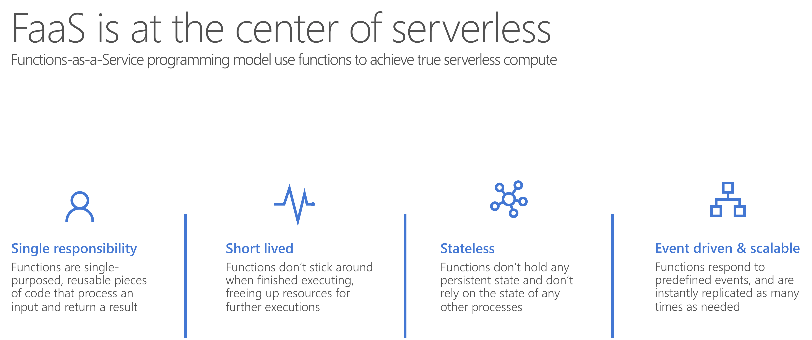
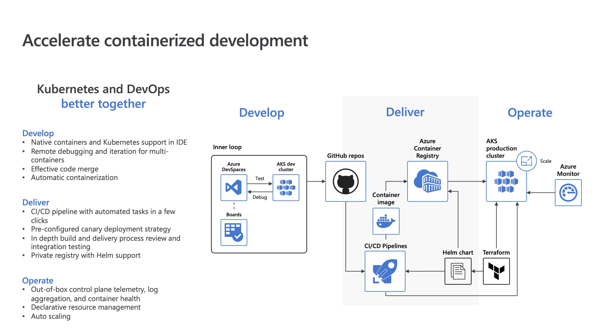

# Integration of Services on Azure

## Messages

- **Raw Data** *Produced* by a service to be *Consumed* or *Stored* elsewhere

- Contains the data that triggered the **Message** pipeline

- **Publisher** of the *Message* has an expectation about how the **Consumer** handles the *Message*

- **Contract** exists between the two sides

  - **Who** is sending the message?
  - **What** is the message?
  - **Where** is the message being sent?

  

## Facts/Events

- **Lightweight** notification of a *Condition* or a *State* change

- **Publisher** of the *Event* has no expectation about how the event is handled

- **Consumer** of the *Event* decides what to do with the notification

- **Events** can be

  - **Discrete** Events report state change and are actionable

    - **Discrete** - Instanteneous

  - **Series** Events report a condition and are analysable; time-ordered and interrelated

    - **Time Series** - Continuous Stream

    

## Orchestraors

- ### Serverless

  

  

  - Full **Abstraction** of *Servers*
  - Instant, **Event-Driven Scalability**
  - **Pay-per-use**

  

  #### Azure Function

  

  

  - **Integrated programming model** 
    - Built-in **Triggers** and **Bindings** to define when a *Function* is invoked and to what *Data* it connects
  - **Enhanced development experience**
    - **Code**, **Test**, **Debug** and **Monitor**
  - **Hosting options flexibility**
    - Multiple *Deployment* models 
    - No Compromise on *Development* experience

  

  #### Logic App

  

  - **Low Code** Approach
  - **Automate** workflows
  - **Orchestrate** business processes
    - *Out-of-the-box* **Connectors** reduce integration challenges
    - *Connect* and *Integrate* Data from the cloud to on-premises
    - **B2B** and Enterprise *Messaging* in the cloud
    - Powerful web-based **Workflow Designer**

  

  #### Containers

- **Deploy** your applications *quickly* and *predictably*

- **Scale** your applications on the fly

- **Roll out** new features seamlessly

- **Limit** hardware usage to required resources only

  

#### App Services

#### API Management

- Cloud hosted, turnkey solution 
- Works with any host, API, and scale
- Promotes and supports developer engagement
- Secures and optimizes APIs
- Provides API insights and analytics

