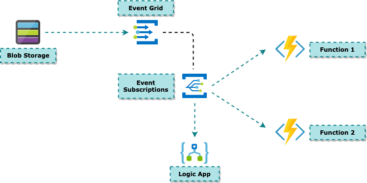

# Integration of Services on Azure


## Introduction

## 

## Event vs Message

Azure offers following services that assist with delivering events or messages throughout a solution:

- **Azure Event Grid**
- **Azure Event Hubs**
- **Azure Service Bus**


### Event


- Lightweight notification of a condition or a state change
- Publisher of the event has no expectation about how the event is handled
- Consumer of the event decides what to do with the notification
- Events can be discrete units or part of a series
  - Discrete events report state change and are actionable
  - Series events report a condition and are analysable. The events are time-ordered and interrelated

### Messages


- Raw data produced by a service to be consumed or stored elsewhere

- Contains the data that triggered the message pipeline

- Publisher of the message has an expectation about how the consumer handles the message

- Contract exists between the two sides

  

### Comparison of Messaging Services

| **Service** | **Purpose**                     | **Type**                      | **When to use**                             |
| ----------- | ------------------------------- | ----------------------------- | ------------------------------------------- |
| Event Grid  | Reactive programming            | Event distribution (discrete) | React to status changes                     |
| Event Hubs  | Big data pipeline               | Event streaming (series)      | Telemetry and distributed data streaming    |
| Service Bus | High-value enterprise messaging | Message                       | Order processing and financial transactions |


## EventGrid


- Publishers emit events, but have no expectation about which events are handled
- Subscribers decide which events they want to handle
- Deeply integrated with Azure services and can be integrated with third-party services
- Simplifies event consumption and lowers costs by eliminating the need for constant polling
- Efficiently and reliably routes events from Azure and non-Azure resources
- Distributes the events to registered subscriber endpoints
- Not a data pipeline, and doesn't deliver the actual object that was updated
- Supports Dead-lettering for events that aren't delivered to an endpoint
- It has the following characteristics:
  - Dynamically scalable
  - Low cost
  - Serverless
  - At least once delivery

#### 

### Events

- Smallest amount of information notifying a change in the system
- **Publishers**
  - Send events to Event Grid
  - Applications, Services Inside Azure Or Outside Azure
- **Sources**
  - Place where the event happens
  - Each Source has one or more Event Types
    - Blob Created Event
    - Message Arrived in Queue Event
    - Azure VM deleted Event
    - Custom events - sent by Applications
      - https://docs.microsoft.com/en-us/azure/event-grid/sdk-overview

### Topics

- Provides an endpoint where the Source sends events

- The publisher creates the event grid topic, and decides whether an event source needs one topic or more than one topic

- A Topic is used for a collection of related events. To respond to certain types of events, subscribers decide which topics to subscribe to

- **System topics**

  - Built-in topics provided by Azure services
  - Azure Storage, Azure Event Hubs and Azure Service Bus

- **Custom topics**

  - application and third-party topics
  - Create Topics according to Modules
  - Avoid sending all events to one topic - reduces flexibility, manageability 

- **Partner Topic**

  - 3rd party SaaS providers to publish events 

  - Their Consumers can subscribe to those events

  - Partner On-boarding - https://docs.microsoft.com/en-us/azure/event-grid/partner-onboarding-overview

    

### Subscribers

- Event handlers; consumes the event
- [Azure functions](https://docs.microsoft.com/en-us/azure/event-grid/handler-functions)
- [Event hubs](https://docs.microsoft.com/en-us/azure/event-grid/handler-event-hubs)
- [Relay hybrid connections](https://docs.microsoft.com/en-us/azure/event-grid/handler-relay-hybrid-connections)
- [Service Bus queues and topics](https://docs.microsoft.com/en-us/azure/event-grid/handler-service-bus)
- [Storage queues](https://docs.microsoft.com/en-us/azure/event-grid/handler-storage-queues)





### Batching

- When using a custom topic, events must always be published in an array
- Recommended to batch several events together per publish to achieve higher efficiency
- Batches can be up to 1 MB. Each event should still not be greater than 1 MB as well

### Event Schema

- **Event Grid Event Schema**

  ```json
  [
    {
      "topic": string,
      "subject": string,
      "id": string,
      "eventType": string,
      "eventTime": string,
      "data":{
        object-unique-to-each-publisher
      },
      "dataVersion": string,
      "metadataVersion": string
    }
  ]
  ```

  - custom topics, the event publisher determines the data object

  - top-level data should have the same fields as standard resource-defined events

    

- **Cloud Event Schema**

  - Defined by Cloud Native foundaion

  - built by several [collaborators](https://github.com/cloudevents/spec/blob/master/community/contributors.md), including Microsoft

    ```json
    {
        "specversion": "1.0",
        "type": "Microsoft.Storage.BlobCreated",  
        "source": "/subscriptions/{subscription-id}/resourceGroups/{resource-group}/providers/Microsoft.Storage/storageAccounts/{storage-account}",
        "id": "9aeb0fdf-c01e-0131-0922-9eb54906e209",
        "time": "2019-11-18T15:13:39.4589254Z",
        "subject": "blobServices/default/containers/{storage-container}/blobs/{new-file}",
        "dataschema": "#",
        "data": {
            "api": "PutBlockList",
            "clientRequestId": "4c5dd7fb-2c48-4a27-bb30-5361b5de920a",
            "requestId": "9aeb0fdf-c01e-0131-0922-9eb549000000",
            "eTag": "0x8D76C39E4407333",
            "contentType": "image/png",
            "contentLength": 30699,
            "blobType": "BlockBlob",
            "url": "https://gridtesting.blob.core.windows.net/testcontainer/{new-file}",
            "sequencer": "000000000000000000000000000099240000000000c41c18",
            "storageDiagnostics": {
                "batchId": "681fe319-3006-00a8-0022-9e7cde000000"
            }
        }
    }
    ```

    | Input schema       | Output schema      |
    | :----------------- | :----------------- |
    | CloudEvents format | CloudEvents format |
    | Event Grid format  | CloudEvents format |
    | Event Grid format  | Event Grid format  |


### Event Delivery

- **Filtering**

  ```json
  "filter": {
    "includedEventTypes": [
      "Microsoft.Resources.ResourceWriteFailure",
      "Microsoft.Resources.ResourceWriteSuccess"
    ]
  }
  ```

  - **Subject filtering**

    - create subjects for your events that make it easy for subscribers to know whether they're interested in the event.

    - Subscribers use the subject to filter and route events

    - The path enables subscribers to narrowly or broadly filter events

      ```json
      "filter": {
        "subjectBeginsWith": "/blobServices/default/containers/mycontainer/log",
        "subjectEndsWith": ".jpg"
      }
      ```

  - **Advanced filtering**

    - operator type - The type of comparison.
    - key - The field in the event data that you're using for filtering. It can be a number, boolean, string, or an array.
    - values - The value or values to compare to the key

    ```json
    "advancedFilters": [{
        "operatorType": "StringContains",
        "key": "data.key1",
        "values": [
            "microsoft", 
            "azure"
        ]
    }]
    ```

    ```json
    "advancedFilters": [
        {
            "operatorType": "StringContains",
            "key": "Subject",
            "values": [
                "/providers/microsoft.devtestlab/",
                "/providers/Microsoft.Compute/virtualMachines/"
            ]
        }
    ]
    ```

    <u>***OR Filtering***</u>

    

    ```json
    "advancedFilters": [
        {
            "operatorType": "StringContains",
            "key": "Subject",
            "values": [
                "/providers/microsoft.devtestlab/"
            ]
        },
        {
            "operatorType": "StringContains",
            "key": "Subject",
            "values": [
                "/providers/Microsoft.Compute/virtualMachines/"
            ]
        }
    ]
    ```

    <u>***AND Filtering***</u>

- **Delivery & Retry**

  - provides durable delivery

  - decides whether it should retry the delivery, dead-letter the event, or drop the event based on the type of the error

  - can't be fixed with retries (for example, if the endpoint is deleted), EventGrid will either perform dead-lettering on the event or drop the event if dead-letter isn't configured

    

    | Endpoint Type   | Error codes                                                  |
    | :-------------- | :----------------------------------------------------------- |
    | Azure Resources | 400 Bad Request, 413 Request Entity Too Large, 403 Forbidden |
    | Webhook         | 400 Bad Request, 413 Request Entity Too Large, 403 Forbidden, 404 Not Found, 401 Unauthorized |

  - Event Grid waits 30 seconds for a response after delivering a message. After 30 seconds, if the endpoint hasn’t responded, the message is queued for retry. Event Grid uses an exponential backoff retry policy for event delivery

  - Event Grid retries delivery on the following schedule on a best effort basis:

    - 10 seconds
    - 30 seconds
    - 1 minute
    - 5 minutes
    - 10 minutes
    - 30 minutes
    - 1 hour
    - 3 hours
    - 6 hours
    - Every 12 hours up to 24 hours

  - If the endpoint responds within 3 minutes, Event Grid will attempt to remove the event from the retry queue on a best effort basis but duplicates may still be received.

- **Disaster Recovery**
  - Event Grid now has an automatic geo disaster recovery (GeoDR) of meta-data not only for new, but all existing domains, topics, and event subscriptions. If an entire Azure region goes down, Event Grid will already have all of your event-related infrastructure metadata synced to a paired region. Your new events will begin to flow again with no intervention by you.
  - Disaster recovery is measured with two metrics:
    - Recovery Point Objective (RPO): the minutes or hours of data that may be lost.
    - Recovery Time Objective (RTO): the minutes or hours the service may be down.
  - Event Grid’s automatic failover has different RPOs and RTOs for your metadata (event subscriptions etc.) and data (events)
  - **Recovery point objective (RPO)**
    - **Metadata RPO**: zero minutes. Anytime a resource is created in Event Grid, it's instantly replicated across regions. When a failover occurs, no metadata is lost.
    - **Data RPO**: If your system is healthy and caught up on existing traffic at the time of regional failover, the RPO for events is about 5 minutes.
  - **Recovery time objective (RTO)**
    - **Metadata RTO**: Though generally it happens much more quickly, within 60 minutes, Event Grid will begin to accept create/update/delete calls for topics and subscriptions.
    - **Data RTO**: Like metadata, it generally happens much more quickly, however within 60 minutes, Event Grid will begin accepting new traffic after a regional failover.

### Security

- **Authorizarion**

  - **Bult-in Roles**

    | Role                                                         | Description                                               |
    | :----------------------------------------------------------- | :-------------------------------------------------------- |
    | [Event Grid Subscription Reader](https://docs.microsoft.com/en-us/azure/role-based-access-control/built-in-roles#eventgrid-eventsubscription-reader) | Lets you read Event Grid event subscriptions.             |
    | [Event Grid Subscription Contributor](https://docs.microsoft.com/en-us/azure/role-based-access-control/built-in-roles#eventgrid-eventsubscription-contributor) | Lets you manage Event Grid event subscription operations. |
    | [Event Grid Contributor](https://docs.microsoft.com/en-us/azure/role-based-access-control/built-in-roles#eventgrid-contributor) | Lets you create and manage Event Grid resources.          |
    | [Event Grid Data Sender](https://docs.microsoft.com/en-us/azure/role-based-access-control/built-in-roles#eventgrid-data-sender) | Lets you send events to Event Grid topics.                |

    

  - **Custom roles**

    ```json
    {
      "Name": "Event grid read only role",
      "Id": "7C0B6B59-A278-4B62-BA19-411B70753856",
      "IsCustom": true,
      "Description": "Event grid read only role",
      "Actions": [
        "Microsoft.EventGrid/*/read"
      ],
      "NotActions": [
      ],
      "AssignableScopes": [
        "/subscriptions/<Subscription Id>"
      ]
    }
    ```

    ```bash
    az role definition create --role-definition <role-file-name.json>
    ```

- **Authentication**

  | Authentication method                                       | Supported handlers                                           | Description                                                  |
  | :---------------------------------------------------------- | :----------------------------------------------------------- | :----------------------------------------------------------- |
  | Access key                                                  | Event HubsService BusStorage QueuesRelay Hybrid ConnectionsAzure FunctionsStorage Blobs (Deadletter) | Access keys are fetched using Event Grid service principal's credentials. The permissions are granted to Event Grid when you register the Event Grid resource provider in their Azure subscription. |
  | Managed System Identity & Role-based access control         | Event HubsService BusStorage QueuesStorage  Blobs (Deadletter) | Enable managed system identity for the topic and add it to the appropriate role on the destination. For details, see [Use system-assigned identities for event delivery](https://docs.microsoft.com/en-us/azure/event-grid/security-authentication#use-system-assigned-identities-for-event-delivery). |
  | Bearer token authentication with Azure AD protected webhook | Webhook                                                      | See the [Authenticate event delivery to webhook endpoints](https://docs.microsoft.com/en-us/azure/event-grid/security-authentication#authenticate-event-delivery-to-webhook-endpoints) section for details.. |
  | Client secret as a query parameter                          | Webhook                                                      | See the [Using client secret as a query parameter](https://docs.microsoft.com/en-us/azure/event-grid/security-authentication#using-client-secret-as-a-query-parameter) section for details. |

- **Network Security**

  - **IP firewall**

  - **Private endpoints**

    - allow ingress of events directly from your virtual network to your topics and domains securely over a [private link](https://docs.microsoft.com/en-us/azure/private-link/private-link-overview) without going through the public internet

    


## Event Hub


- Facilitates the capture, retention, and replay of telemetry and event stream data 
- Data can come from many concurrent sources
- Single solution that enables rapid data retrieval for real-time processing as well as repeated replay of stored raw data
- Can capture the streaming data into a file for processing and analysis
- Available either as data streams or bundled event batches
- Characteristics:
  - Low Latency
  - Capable of receiving and processing millions of events per second
  - At least once delivery


### **Namespace**

### **Event publishers**

- **Publishing an event**
- **Publisher Policy**
- **Capture**
- **Partitions**
- **Event Retention**

### Event Consumers

- **Consumer Groups**
- **Checkpointing**
- **Stream offsets**

### Tiers

- **Basic** and **Standard**
- **Dedicated**
- **Premium**


## References